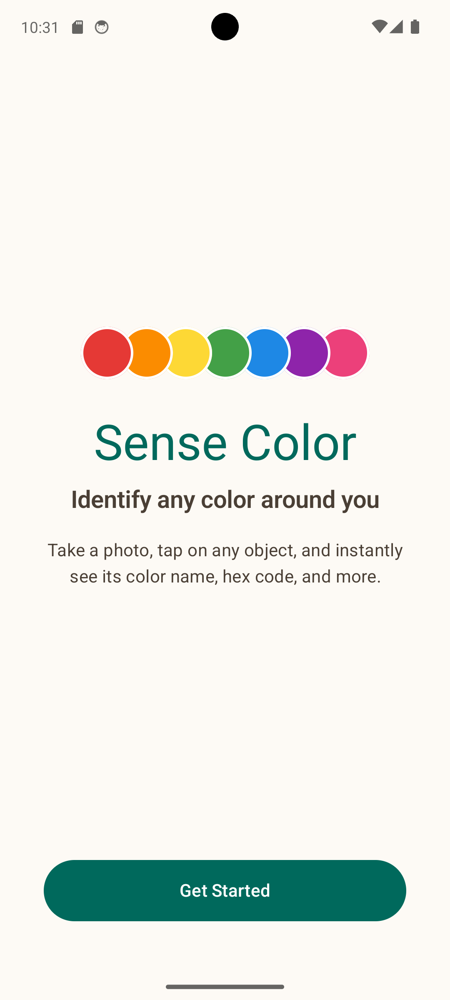
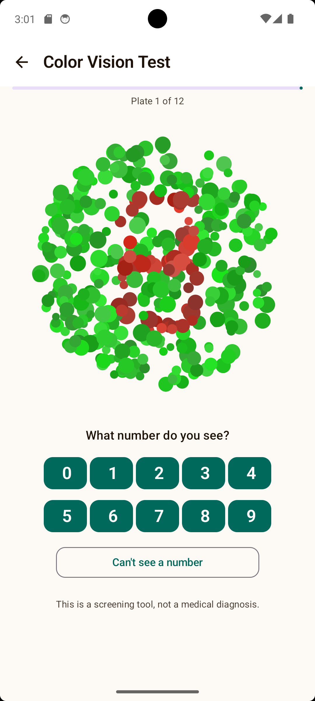
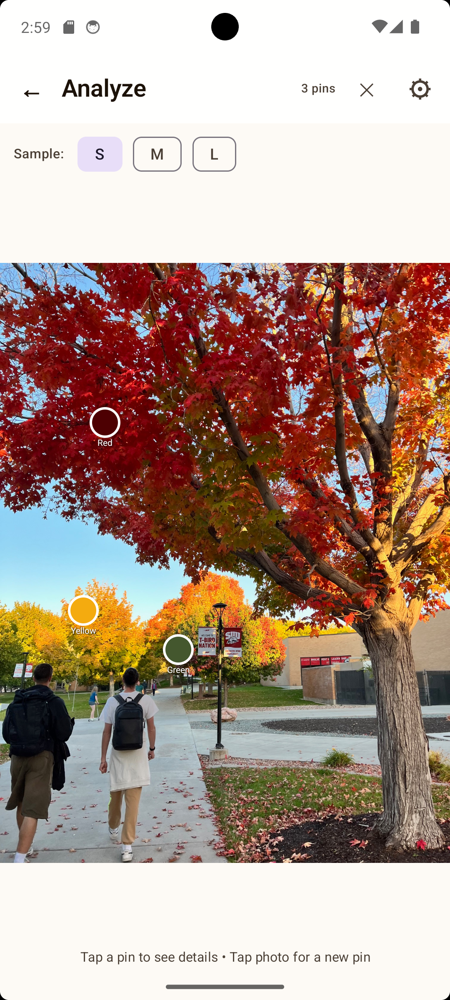
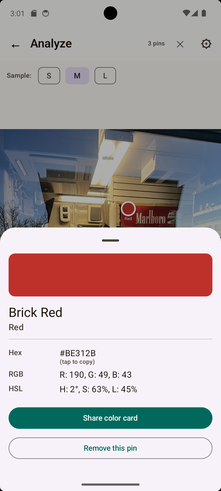
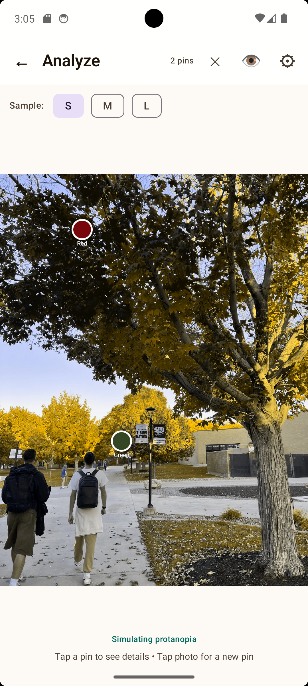
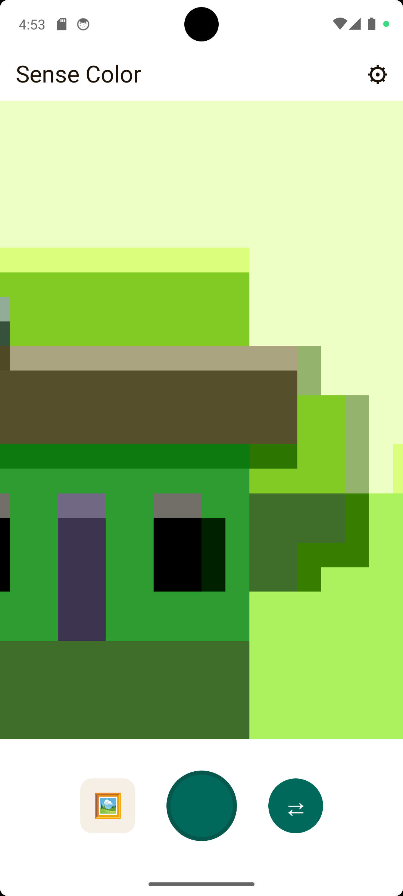
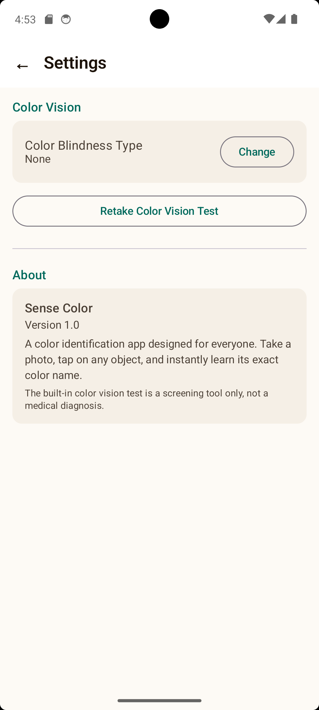
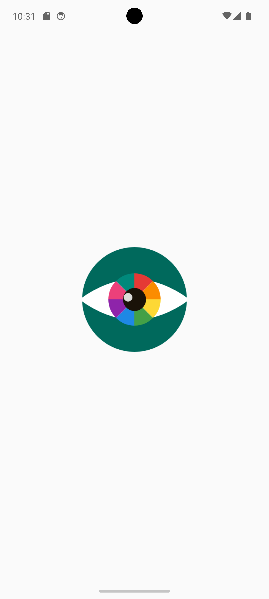

# Sense Color

A color identification Android app designed for everyone — especially users with color vision deficiencies. Point your camera at anything, tap on it, and instantly get the exact color name, hex code, RGB, and HSL values.

<p align="center">
  
  
  
  
</p>

<p align="center">
  
  
  
  
</p>

---

## Features

- **Tap to identify** — tap any spot on a photo to instantly name the color
- **Two-tier color naming** — returns a specific name (e.g. "Brick Red") and a primary category (e.g. "Red"), using a 155-color HSL nearest-neighbor lookup
- **Color blindness simulation** — toggle a live filter that shows the photo as seen through your vision type (protanopia, deuteranopia, tritanopia, and more) using Machado 2009 daltonization matrices
- **Confusion warnings** — automatically flags colors that are commonly confused for your specific type of color vision deficiency
- **Color vision test** — built-in Ishihara-style dot plate test (12 plates, programmatically generated) to determine your color blindness type
- **Share color card** — generates a designed PNG card with the color swatch, name, and values and shares it via Android's native share sheet
- **Gallery import** — analyze colors from any photo in your library, not just ones you take
- **Front/back camera toggle**
- **Animated pins** — spring bounce animation when a color pin is placed
- **Hex copy to clipboard** — tap the hex value to copy it instantly

---

## Tech Stack

| Layer | Technology |
|---|---|
| Language | Kotlin |
| UI | Jetpack Compose + Material 3 |
| Architecture | MVVM (ViewModel + StateFlow) |
| Camera | CameraX (Preview + ImageCapture) |
| Persistence | DataStore Preferences |
| Navigation | Navigation Compose |
| Color Science | HSL color space, Machado 2009 matrices |
| Typography | DM Serif Display + DM Sans (Google Fonts) |
| Min SDK | 26 (Android 8.0) |

---

## How It Works

1. **Onboarding** — user indicates whether they have color vision deficiency
2. **Color vision test** — 12 programmatic Ishihara-style plates score and classify the user's vision type
3. **Camera / Gallery** — take a photo or pick one from the gallery
4. **Tap to analyze** — normalized tap coordinates map to pixel position using ContentScale.Fit math; a configurable pixel region (S/M/L) is averaged and converted to HSL
5. **Color naming** — HSL value is matched against 155 named colors via weighted nearest-neighbor distance
6. **Confusion detection** — the identified color is checked against known confusion pairs for the user's vision type
7. **Simulation** — a 3×3 RGB matrix (converted to Android ColorMatrix) is applied to the full bitmap to simulate the user's vision

---

## Setup

1. Clone the repo
   ```bash
   git clone https://github.com/eduardobussien/Sense-Color.git
   ```
2. Open in **Android Studio** (Hedgehog or newer)
3. Let Gradle sync
4. Run on a device or emulator (API 26+)

No API keys required. Everything runs on-device.

---

## Screenshots

| Onboarding | Color Test | Analysis | Detail Sheet |
|---|---|---|---|
|  |  |  |  |

| Simulation | Camera | Settings | Splash |
|---|---|---|---|
|  |  |  |  |

---

## Disclaimer

The built-in color vision test is a screening tool only and is not a substitute for a professional medical diagnosis.

---

*Built with Kotlin + Jetpack Compose*
